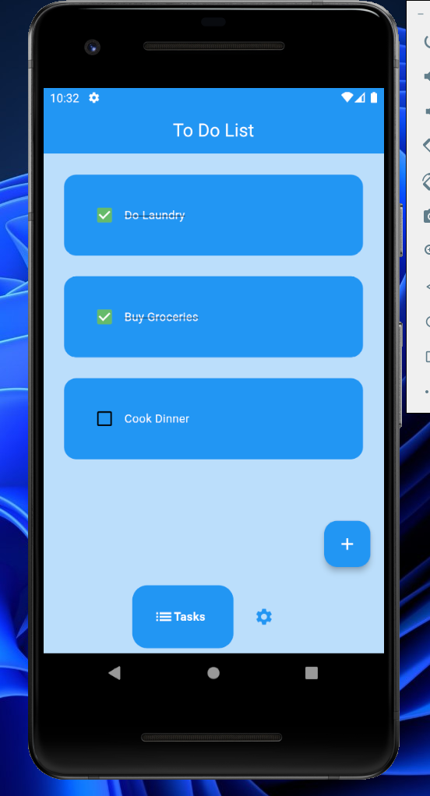

# ToDo List App

A simple and interactive to-do list mobile app built with Flutter. Manage your tasks efficiently with a user-friendly interface, customizable themes including light and dark modes, and efficient local storage using Hive database.

## Features

- **Tasks Page:**
  - View a list of tasks.
  - Mark tasks as done or undone.
  - Delete tasks.

- **Settings Page:**
  - Toggle between light and dark themes.
  - Customize the app's appearance.

- **Local Storage:**
  - Efficiently store tasks using Hive database.
  - Persist data between app sessions.
 
## Getting Started

To get started with the ToDo List app, follow these steps:

1. **Clone the repository to your local machine:**
2. Navigate to the project directory
3. Install dependencies
4. Run the app
   
## Screenshots

| Light Mode Task Page | Create Task |
| :-------------------:|:-----------:|
|  |  |

| Task Page Completed  | Settings    |
| :-------------------:|:-----------:|
|  |  |

